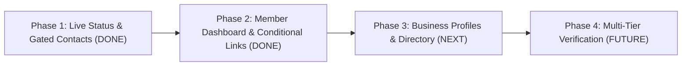

# 🚀 EXIM Growth Network Platform - Status & Roadmap

> **Current Build Status:** ✅ `npm run build` passing cleanly (0 errors)  
> **Git Status Notice:** ⚠️ Local changes tested & saved. **Do NOT push to Git** per user directive.

---

## 📌 Project Overview
EXIM Growth Network is a high-trust global trade onboarding and lead generation platform designed for Exporters, Importers, Manufacturers, Logistics Providers, and EXIM Consultants. The platform features an automated **WhatsApp Trade Post Generator**, a **Public Live Post Verification Hub**, a **Member Dashboard**, an **Admin Control Center**, and upcoming **EXIM Business Profiles & Network Directory**.

---

## ✅ Completed Features & Accomplishments

### 1. WhatsApp Trade Post Generator & Visual Canvas (`PostTemplatePortal.jsx`, `PostCardCanvas.jsx`)
- **800x800 Visual Banner Generator:** Generates high-resolution PNG image banners with deep ocean navy gradients, brand header bar, commodity image overlay, dual-column specs box, and category badges (`BUY`, `SELL`, `LOGISTICS`, `SERVICES`, `QUESTION`).
- **Target / Offering Price Integration:** Replaced HSN codes with free-text Target Price (`$6,500 / MT`, `FOB`) and Offering Price (`₹450 / Kg`).
- **Dynamic Multi-Line Text Wrapping:** Updated canvas `wrapText` math (`maxLines = 4`) so long certification & quality text (FSSAI, ISO 22000, Spices Board CRES) wraps across multiple lines without truncating into `...`.
- **Trade Presets:** Kerala export commodities (Black Pepper, Cardamom, Cashew, Coir, Rubber), major global ports (Cochin, Jebel Ali, Rotterdam, Felixstowe), container types, and compliance standards.
- **WhatsApp Direct Sharing:** 1-tap direct group share button (`📷 Image Download + 📋 Formatted Text Copy + WhatsApp Open`).

---

### 2. Live Post Verification & Gated Contact Access (`PostDetailView.jsx`)
- **Public Verification Route (`/post/:postId`):** Every generated post gets a unique post ID (`post-${Date.now()}`).
- **Real-Time Status Badge:** Displays `🟢 LIVE & ACCEPTING QUOTES` vs `🔴 ORDER FULFILLED`.
- **Gated Poster Contact Info:** Unauthenticated visitors see masked phone/email protected behind a **"Member Privileges & Benefits"** card outlining member advantages.
- **1-Click Unlock:** Unlocks full poster contact info & direct WhatsApp button upon 1-tap Google login.

---

### 3. Member Dashboard & 15-Second Lead Re-Use (`MemberDashboard.jsx`)
- **Route (`/dashboard`):** Personalized member control center.
- **Live Metrics:** Total Saved Posts, Active Open Leads, Fulfilled Orders.
- **1-Click Lead Status Toggle:** Allows members to switch status (`Mark Fulfilled` / `Re-open Lead`) anytime to stop unwanted WhatsApp inquiries.
- **15-Second Post Editing:** "Edit Details" action prefills the Post Generator form with saved specs so members don't retype details from scratch.
- **Gated Guest Onboarding Card:** Unauthenticated visitors see an **"Unlock EXIM Member Dashboard"** card detailing member privileges and 1-click Google Sign-In.

---

### 4. Conditional WhatsApp Tracking Link
- **Guest / Normal Users:** Generates clean trade text without tracking links.
- **Logged-In Members:** Automatically appends `🔗 Check Live Status & Connect: http://localhost:5173/post/post-xxx` to shared WhatsApp posts.

---

### 5. 1-Click Google OAuth & Authentication (`supabase.js`, `memberAuth.js`)
- Integrated `signInWithGoogle()` with Supabase OAuth and instant local fallback.
- Added **`[ 🌐 Continue with Google ]`** action buttons across the Post Generator, Live Post Verification, and Member Dashboard.

---

### 6. Admin Control Center & Trade Posts Hub (`AdminPortal.jsx`, `AdminTradePostsHub.jsx`)
- **Security Passcode Protection (`admin123`).**
- **2x2 Stats Grid Overview:** Total Applications, Verified Members, Trade Posts, Active Leads.
- **Admin Trade Posts Log:** Real-time search, category filters (`BUY`, `SELL`, `Logistics`, `Services`, `Questions`), post inspector modal, and **Export to CSV** action (`EXIM_Trade_Posts_Export.csv`).

---

## ⌛ Pending & In-Progress Tasks

- [ ] **Supabase Production RLS & Tables Sync:** Configure live Supabase database tables (`trade_posts_all`, `member_profiles`) when production environment keys are supplied.
- [ ] **Image CORS Proxy Hardening:** Ensure external stock photo sources pass `Access-Control-Allow-Origin: *` headers for all mobile web browsers.

---

## 🔮 Next Phase Building Roadmap

### 🏬 Phase 3: Public EXIM Business Profiles & Directory (Next Up)
- **Standalone Profile Route (`/business/:profileId` or `join.eximgrowth.com/business/:profileId`):**
  - Standardized business cards for Exporters, Importers, Manufacturers, and Freight Forwarders.
  - Company details: Company Name, Designation, Products, Certifications, Operating Ports, and Product Gallery.
  - Contact Information: Primary/Secondary Phone, WhatsApp, Email, Website, LinkedIn, and Social Media links.
- **Searchable EXIM Directory (`/directory`):**
  - Searchable directory of verified business profiles filtered by role (`Exporter`, `Importer`, `Manufacturer`, `Logistics`) and commodity type.

---

### 🛡️ Phase 4: Multi-Tier Verification & Trust Badges (Far Future)
- **Self-Service Verification Application:**
  - Auto-filled form with pre-existing company details, IEC code, GSTIN, and ISO certificates upload.
- **Physical Verification Notice:**
  - "Coming Soon: On-Site Location Inspection by EXIM Growth Verification Team" notice.

---

## 📁 Key File Structure & Locations

| Component / Module | File Path |
| :--- | :--- |
| **App Routes & Entry** | [App.jsx](file:///d:/Anti-Gravity%20workspace/test%20project/src/App.jsx) |
| **Post Generator Portal** | [PostTemplatePortal.jsx](file:///d:/Anti-Gravity%20workspace/test%20project/src/components/postTemplate/PostTemplatePortal.jsx) |
| **Canvas 800x800 Generator** | [PostCardCanvas.jsx](file:///d:/Anti-Gravity%20workspace/test%20project/src/components/postTemplate/PostCardCanvas.jsx) |
| **Live Post Verification** | [PostDetailView.jsx](file:///d:/Anti-Gravity%20workspace/test%20project/src/components/postTemplate/PostDetailView.jsx) |
| **Member Dashboard** | [MemberDashboard.jsx](file:///d:/Anti-Gravity%20workspace/test%20project/src/components/dashboard/MemberDashboard.jsx) |
| **Admin Control Center** | [AdminPortal.jsx](file:///d:/Anti-Gravity%20workspace/test%20project/src/components/admin/AdminPortal.jsx) |
| **Admin Trade Posts Hub** | [AdminTradePostsHub.jsx](file:///d:/Anti-Gravity%20workspace/test%20project/src/components/admin/AdminTradePostsHub.jsx) |
| **Supabase & Google Auth** | [supabase.js](file:///d:/Anti-Gravity%20workspace/test%20project/src/lib/supabase.js) |
| **Member Session Auth** | [memberAuth.js](file:///d:/Anti-Gravity%20workspace/test%20project/src/lib/memberAuth.js) |
| **Product Roadmap Plan** | [implementation_plan.md](file:///C:/Users/favas/.gemini/antigravity-ide/brain/a81b0e1d-5419-4918-af58-5ebcda097606/implementation_plan.md) |
